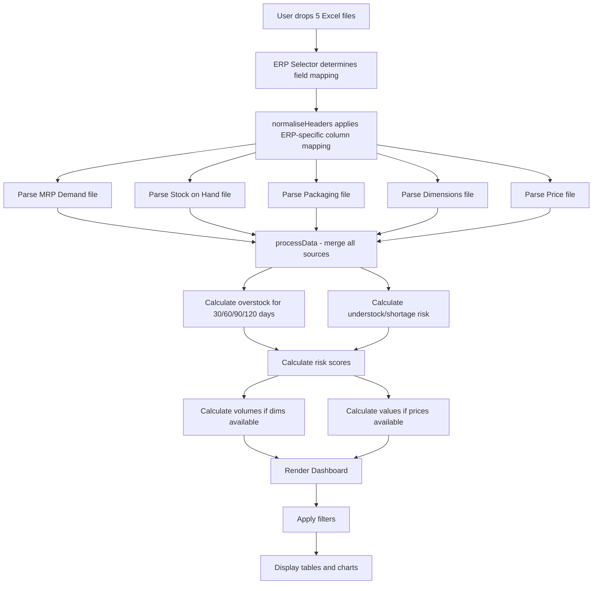

# StockSense Implementation Plan
## IBM Bob Hackathon - "Turn Idea Into Impact Faster"

---

## Executive Summary

**Project:** StockSense - Zero-install inventory health intelligence tool  
**Architecture:** Single HTML file, browser-based, no backend  
**Target Users:** Supply chain analysts across all industries  
**Key Innovation:** Universal ERP compatibility layer + dual overstock/understock detection  
**Demo Ready:** Works with 5 dummy Excel files, processes in <3 seconds

---

## Technical Architecture Overview

### Single-File Design
```
StockSense.html (one file, ~2000-2500 lines)
├── HTML Structure
│   ├── Header (sticky)
│   ├── Upload Screen
│   ├── Dashboard (6 tabs)
│   └── Modals (custom mapping guide)
├── CSS Styling (~400 lines)
│   ├── Dark teal/green theme
│   ├── Google Fonts (Bebas Neue, DM Sans, JetBrains Mono)
│   └── Responsive grid layouts
└── JavaScript (~1500 lines)
    ├── ERP field mapping layer
    ├── File parsing (5 file types)
    ├── Data processing engine
    ├── Dashboard rendering
    ├── Chart.js visualizations
    ├── Filtering system
    ├── Snapshot save/load
    └── Excel export
```

### External Dependencies (CDN)
- **SheetJS** (xlsx.full.min.js) - Excel file parsing
- **Chart.js** - Data visualizations
- **Google Fonts** - Typography

---

## Data Flow Architecture



---

## Implementation Phases

### Phase 1: Foundation (Tasks 3-5)
**Goal:** Create base HTML structure with branding and styling

**Deliverables:**
- Complete HTML skeleton with semantic structure
- StockSense branding (logo, colors, typography)
- Sticky header with MRP date badge and action buttons
- ERP/WMS selector dropdown in header corner
- Upload screen with 5 drop zones (MRP, Stock, Packaging, Dims, Prices)
- Loading overlay with progress indicator

**Key Design Elements:**
- Dark teal/green color scheme (#1a4d4d primary, #2d7a7a accent)
- Bebas Neue for headings, DM Sans for body, JetBrains Mono for data
- Card-based layout with subtle shadows
- Drag-and-drop zones with visual feedback

---

### Phase 2: ERP Compatibility Layer (Tasks 6-9)
**Goal:** Build universal field mapping system for 6 ERP/WMS platforms

**ERP Profiles to Implement:**

1. **Standard / Custom** (default)
   - Uses generic column names
   - No transformation needed

2. **SAP MM / EWM**
   - WERKS → Plant/Site
   - LIFNR → Vendor code
   - MATNR → Part number
   - LABST → Stock on hand
   - LGORT → Warehouse

3. **Oracle SCM**
   - ORGANIZATION_CODE → Plant/Site
   - SUPPLIER_NUMBER → Vendor code
   - ITEM_NUMBER → Part number
   - ON_HAND_QUANTITY → Stock on hand

4. **Dynamics 365**
   - SITE → Plant/Site
   - VENDOR_ACCOUNT → Vendor code
   - ITEM_NUMBER → Part number
   - ON_HAND_QTY → Stock on hand

5. **Infor WMS**
   - FACILITY → Plant/Site
   - VENDOR_ID → Vendor code
   - ITEM_NBR → Part number
   - QTY_ON_HAND → Stock on hand

6. **Manhattan Associates**
   - FACILITY_ID → Plant/Site
   - VENDOR_NBR → Vendor code
   - SKU_NBR → Part number
   - ON_HAND_QTY → Stock on hand

**Implementation Strategy:**
```javascript
const ERP_MAPS = {
  standard: { /* no transformation */ },
  sap: {
    mrpPlantCol: 'WERKS',
    mrpVendorCol: 'LIFNR',
    mrpPartCol: 'MATNR',
    stkWarehouse: 'LGORT',
    stkItem: 'MATNR',
    stkSoh: 'LABST',
    // ... site and warehouse mappings
  },
  // ... other ERP profiles
};

function normaliseHeaders(rows, erpKey) {
  const map = ERP_MAPS[erpKey];
  // Transform column names based on ERP profile
  // Return normalised rows with standard column names
}
```

**Custom Mapping Modal:**
- Full-screen overlay with field mapping guide
- Explains required columns for each file type
- Provides Excel rename instructions
- Includes practical tips for one-time setup

---

### Phase 3: Data Processing Engine (Tasks 10-15)
**Goal:** Parse 5 file types and merge into unified data structure

**File Parsers:**

1. **MRP Demand Parser**
   - Reads positional columns (plant at 0, vendor at 1, part at 8)
   - Extracts analyst/planner name
   - Parses 125 daily demand columns starting at index 38
   - Calculates cumulative demand for 30/60/90/120 day horizons
   - Handles date format variations

2. **Stock on Hand Parser**
   - Reads warehouse, item, quantity columns
   - Maps warehouse codes to sites (WBN/STA or Site A/B)
   - Handles multiple warehouse entries per part

3. **Packaging Parser**
   - Joins child item to packaging item
   - Extracts quantity per box
   - Identifies default package definition
   - Creates pack group labels

4. **Dimensions Parser**
   - Reads L/W/H in centimeters
   - Joins to packaging items
   - Calculates volume per box (cm³)

5. **Price Parser**
   - Reads positional columns (A=part, C=price, D=ATB, E=obsolete)
   - Handles currency formatting
   - Extracts boolean flags

**Data Structure (allParts array):**
```javascript
{
  part: "BFS-001",
  site: "WBN",
  vendor: "V123",
  vname: "Fastener Corp",
  analyst: "John Smith",
  soh: 5000,
  packGroup: "Box-Small",
  isTLS: false,
  d30: 1000,
  d60: 2000,
  d90: 3000,
  d120: 4000,
  over30: 4000,    // soh - d30
  over60: 3000,
  over90: 2000,
  over120: 1000,
  under30: 0,      // max(0, d30 - soh)
  under60: 0,
  under90: 0,
  under120: 0,
  risk: "Critical",
  shortageRisk: "None",
  pkgItem: "PKG-SM",
  qtyPerBox: 100,
  ov30: 0.12,      // overstock volume m³
  price: 2.50,
  atb: false,
  obs: false,
  osVal30: 10000   // overstock value GBP
}
```

---

### Phase 4: Overstock & Understock Logic (Tasks 16-18)
**Goal:** Implement dual detection system with risk scoring

**Overstock Calculation:**
```javascript
// For each horizon (30/60/90/120 days)
over30 = soh - d30;  // positive = overstocked

// Risk scoring
if (over30 > 0) {
  if (over120 > 0) risk = 'Critical';      // 4+ months excess
  else if (over90 > 0) risk = 'High';      // 3 months excess
  else if (over60 > 0) risk = 'Medium';    // 2 months excess
  else risk = 'Low';                        // 1 month excess
}

// Volume calculation (if dimensions available)
ov30 = (over30 / qtyPerBox) * (L * W * H / 1000000);  // m³

// Value calculation (if prices available)
osVal30 = over30 * price;  // GBP
```

**Understock Calculation:**
```javascript
// For each horizon
under30 = Math.max(0, d30 - soh);  // shortage quantity

// Shortage risk scoring
if (under30 > 0) {
  const coverage = soh / d30;  // what % of demand is covered
  if (coverage < 0.5) shortageRisk = 'Critical';   // <50% coverage
  else if (coverage < 0.75) shortageRisk = 'High'; // <75% coverage
  else if (coverage < 0.90) shortageRisk = 'Medium';
  else shortageRisk = 'Low';
}

// Shortage value at risk (if prices available)
shortageVal30 = under30 * price;  // cost of production stoppage
```

---

### Phase 5: Dashboard UI (Tasks 19-25)
**Goal:** Build 6-tab navigation with tables and visualizations

**Tab Structure:**

1. **⭐ Overview**
   - Dual KPI card layout (overstock left, understock right)
   - Top 10 overstock parts table
   - Top 10 understock parts table
   - Risk distribution pie charts
   - Trend charts (if multiple snapshots)

2. **📈 Analysis**
   - Overstock by vendor bar chart
   - Understock by vendor bar chart
   - Risk distribution by site
   - Volume/value breakdown
   - Pack group analysis

3. **📋 Overstock**
   - Full sortable table
   - Columns: Part, Site, Vendor, SOH, Demand, Excess, Risk, Volume, Value
   - Color-coded risk badges
   - Export to Excel button

4. **⚠️ Understock** (NEW)
   - Full sortable table
   - Columns: Part, Site, Vendor, SOH, Demand, Shortage, Risk, Value at Risk
   - Blue/cyan color scheme (not red)
   - Export to Excel button

5. **🗂️ All Parts**
   - Complete inventory view
   - All columns visible
   - Multi-column sort
   - Search across all fields

6. **🔍 Not on MRP**
   - Parts in stock with no demand
   - Potential obsolete inventory
   - Candidate for disposal/return

**KPI Cards:**

Overstock Side:
- Overstocked Parts (count with trend)
- Total Overstock Qty (units)
- Critical Risk Parts (count)
- Overstock Value (£X.XX million)
- Overstock Volume (X.X m³)

Understock Side:
- Understocked Parts (count with trend)
- Total Shortage Qty (units)
- Critical Shortage Parts (count)
- Value at Risk (£X.XX million)
- Coverage % (average across all parts)

---

### Phase 6: Filtering System (Tasks 26-27)
**Goal:** Implement comprehensive filter drawer with view modes

**Filter Options:**

1. **Site Filter**
   - Both / WBN / STA (or Site A / Site B)
   - Radio buttons

2. **Horizon Filter**
   - 30 / 60 / 90 / 120 days
   - Radio buttons
   - Affects which over/under columns are displayed

3. **Vendor Filter**
   - Dropdown populated from data
   - Multi-select with checkboxes
   - Search within dropdown

4. **Risk Filter** (Overstock)
   - Critical / High / Medium / Low / None
   - Checkboxes

5. **Shortage Risk Filter** (Understock)
   - Critical / High / Medium / Low / None
   - Checkboxes

6. **Part Search**
   - Text input with live filtering
   - Searches part number and description

7. **Analyst Filter**
   - Dropdown from MRP data
   - Multi-select

8. **Flags**
   - ATB (checkbox)
   - Obsolete (checkbox)
   - TLS/Kit Vendor (checkbox)

9. **Pack Group Filter**
   - Dropdown from packaging data
   - Multi-select

10. **View Mode** (NEW)
    - Overstock Only
    - Understock Only
    - Both (default)
    - Radio buttons
    - Affects which parts are shown in tables

11. **Sort By**
    - Quantity (default)
    - Volume (if dims loaded)
    - Value (if prices loaded)
    - Risk level
    - Dropdown

**Filter Drawer Design:**
- Slide-in panel from right
- Toggle button in header
- Apply/Reset buttons
- Active filter count badge
- Persists across tab switches

---

### Phase 7: Snapshot & Export (Tasks 28-31)
**Goal:** Enable save/load and Excel export functionality

**Snapshot Save:**
```javascript
function saveSnapshot() {
  const snapshot = {
    version: '1.0',
    timestamp: new Date().toISOString(),
    mrpDate: MRP_DATE,
    allParts: allParts,
    filters: currentFilters,
    activeTab: activeTab,
    erpSystem: ACTIVE_ERP
  };
  
  // Embed snapshot data in HTML file
  const html = document.documentElement.outerHTML;
  const snapshotHTML = html.replace(
    '</body>',
    `<script>window.SNAPSHOT_DATA = ${JSON.stringify(snapshot)};</script></body>`
  );
  
  // Download as HTML file
  const blob = new Blob([snapshotHTML], { type: 'text/html' });
  const url = URL.createObjectURL(blob);
  const a = document.createElement('a');
  a.href = url;
  a.download = `StockSense_Snapshot_${timestamp}.html`;
  a.click();
}
```

**Snapshot Load:**
```javascript
// On page load, check for embedded snapshot
if (window.SNAPSHOT_DATA) {
  allParts = window.SNAPSHOT_DATA.allParts;
  MRP_DATE = window.SNAPSHOT_DATA.mrpDate;
  // Restore filters and active tab
  // Render dashboard
}
```

**Excel Export:**
```javascript
function exportToExcel() {
  const wb = XLSX.utils.book_new();
  
  // Sheet 1: Overview KPIs
  const overviewData = [
    ['StockSense Analysis Report'],
    ['Generated:', new Date().toISOString()],
    ['MRP Date:', MRP_DATE],
    [],
    ['Overstock Summary'],
    ['Overstocked Parts:', overstockedCount],
    ['Total Overstock Qty:', totalOverstockQty],
    // ... more KPIs
  ];
  XLSX.utils.book_append_sheet(wb, XLSX.utils.aoa_to_sheet(overviewData), 'Overview');
  
  // Sheet 2: Overstock Details
  const overstockData = allParts
    .filter(p => p.over30 > 0)
    .map(p => ({
      Part: p.part,
      Site: p.site,
      Vendor: p.vendor,
      'Vendor Name': p.vname,
      SOH: p.soh,
      'Demand (30d)': p.d30,
      'Excess (30d)': p.over30,
      Risk: p.risk,
      'Volume (m³)': p.ov30,
      'Value (£)': p.osVal30
    }));
  XLSX.utils.book_append_sheet(wb, XLSX.utils.json_to_sheet(overstockData), 'Overstock');
  
  // Sheet 3: Understock Details (NEW)
  const understockData = allParts
    .filter(p => p.under30 > 0)
    .map(p => ({
      Part: p.part,
      Site: p.site,
      Vendor: p.vendor,
      'Vendor Name': p.vname,
      SOH: p.soh,
      'Demand (30d)': p.d30,
      'Shortage (30d)': p.under30,
      'Shortage Risk': p.shortageRisk,
      'Value at Risk (£)': p.shortageVal30
    }));
  XLSX.utils.book_append_sheet(wb, XLSX.utils.json_to_sheet(understockData), 'Understock');
  
  // Sheet 4: All Parts
  // Sheet 5: Not on MRP
  
  // Download
  XLSX.writeFile(wb, `StockSense_Export_${timestamp}.xlsx`);
}
```

---

### Phase 8: Performance Optimization (Task 32)
**Goal:** Ensure <3 second processing for 110 rows × 163 columns

**Optimization Strategies:**

1. **Efficient Data Structures**
   - Use Map for O(1) lookups (part → data)
   - Pre-calculate all metrics during initial processing
   - Avoid recalculating on filter changes

2. **Lazy Rendering**
   - Virtual scrolling for tables >100 rows
   - Render only visible rows
   - Paginate if needed

3. **Debounced Filtering**
   - 300ms delay on text input
   - Batch filter updates
   - Cancel pending renders

4. **Web Workers** (if needed)
   - Offload heavy calculations
   - Parse large files in background
   - Keep UI responsive

5. **Memory Management**
   - Clear unused data structures
   - Reuse DOM elements
   - Avoid memory leaks in event listeners

**Performance Targets:**
- File parsing: <1 second
- Data processing: <1 second
- Dashboard render: <1 second
- Filter application: <100ms
- Table sort: <200ms

---

### Phase 9: Testing & Documentation (Tasks 33-34)
**Goal:** Validate with dummy data and create demo materials

**Test Scenarios:**

1. **Standard ERP with all 5 files**
   - Expected: 96 overstocked parts, 48 Critical
   - Expected: ~30 understocked parts
   - Verify volume and value calculations

2. **Standard ERP with MRP + Stock only**
   - Expected: Basic overstock/understock detection
   - No volume or value data

3. **SAP ERP profile**
   - Rename columns in dummy files to SAP format
   - Verify field mapping works correctly

4. **Filter combinations**
   - Site filter
   - Risk filter
   - View mode toggle
   - Multiple filters simultaneously

5. **Snapshot save/load**
   - Save snapshot
   - Close browser
   - Reopen snapshot file
   - Verify all data and filters restored

6. **Excel export**
   - Verify all sheets present
   - Check data accuracy
   - Validate formulas (if any)

**Demo Script for Judges:**

```
1. Introduction (30 seconds)
   "Every supply chain team wastes hours every week analyzing inventory in Excel.
    StockSense automates this completely. Watch this."

2. File Upload (15 seconds)
   - Select "Standard" ERP
   - Drop all 5 dummy files
   - Click "Analyse"
   - Point out: "4 seconds. Done."

3. Overview Dashboard (45 seconds)
   - "96 parts overstocked - that is £X million tied up in excess inventory"
   - "48 Critical risk parts - these have 4+ months of excess stock"
   - "30 parts understocked - production risk today"
   - Switch to Understock tab
   - "These parts could stop production this week"

4. Filtering (30 seconds)
   - Filter by Critical shortage risk
   - "These 8 parts need immediate action"
   - Show vendor breakdown
   - "This vendor is causing 60% of our shortage risk"

5. Export & Snapshot (30 seconds)
   - Export to Excel
   - "Full report ready for management"
   - Save snapshot
   - "Self-contained HTML file - email it, archive it, no data loss"

6. The IBM Bob Story (30 seconds)
   "We built this with IBM Bob as our development partner.
    Bob designed the ERP compatibility layer, extended the analysis
    from overstock-only to full inventory health, and helped us
    turn a company-specific tool into a universal platform.
    Zero install. Works on any ERP. Built in a weekend."

Total: 3 minutes
```

**Judge Presentation Notes:**

**Problem Statement:**
- Every company has inventory imbalance
- Manual Excel analysis takes 4-8 hours per week
- Costs millions in tied-up cash and production delays

**Solution:**
- Zero-install browser tool
- Universal ERP compatibility
- Dual overstock/understock detection
- 4-second analysis vs 4-hour manual process

**Technical Innovation:**
- Single-file architecture (no backend, no install)
- ERP field mapping layer (works with SAP, Oracle, Dynamics, Infor, Manhattan)
- Client-side processing (data never leaves the browser)
- Snapshot technology (self-contained HTML reports)

**Business Impact:**
- Saves 200+ hours per year per analyst
- Identifies millions in excess inventory
- Prevents production stoppages
- Works across all industries

**IBM Bob Contribution:**
- Architecture design
- ERP compatibility layer
- Risk scoring algorithms
- Understock detection logic
- Performance optimization
- Dummy data generation

---

## File Structure

```
StockSense.html (single file)
├── <!DOCTYPE html>
├── <head>
│   ├── <meta charset="UTF-8">
│   ├── <title>StockSense — Inventory Health Intelligence</title>
│   ├── <link> Google Fonts
│   ├── <script> SheetJS CDN
│   ├── <script> Chart.js CDN
│   └── <style> All CSS (~400 lines)
├── <body>
│   ├── <header> Sticky header with logo, ERP selector, actions
│   ├── <div id="upload-screen"> File upload interface
│   ├── <div id="dashboard"> 6-tab dashboard (hidden initially)
│   ├── <div id="filter-drawer"> Filter panel
│   ├── <div id="custom-mapping-modal"> ERP mapping guide
│   └── <script> All JavaScript (~1500 lines)
│       ├── Global variables
│       ├── ERP_MAPS configuration
│       ├── File parsing functions
│       ├── Data processing engine
│       ├── Dashboard rendering
│       ├── Chart.js setup
│       ├── Filter logic
│       ├── Snapshot save/load
│       └── Excel export
└── </body>
```

---

## Key Implementation Notes

### No Apostrophes in Template Literals
```javascript
// WRONG - causes SyntaxError
const msg = `It's ready`;

// CORRECT
const msg = `It is ready`;
const msg = `Do not use apostrophes`;
```

### Positional Column Parsing (Price File)
```javascript
// Price file uses column indices, not headers
const part = row[0];        // Column A
const desc = row[1];        // Column B
const price = row[2];       // Column C
const atb = row[3];         // Column D
const obs = row[4];         // Column E
```

### Date Column Handling (MRP File)
```javascript
// MRP file has 125 daily demand columns starting at index 38
const dateColumns = [];
for (let i = 38; i < row.length; i++) {
  if (row[i] && !isNaN(row[i])) {
    dateColumns.push(parseFloat(row[i]));
  }
}

// Calculate cumulative demand
const d30 = dateColumns.slice(0, 30).reduce((a, b) => a + b, 0);
const d60 = dateColumns.slice(0, 60).reduce((a, b) => a + b, 0);
const d90 = dateColumns.slice(0, 90).reduce((a, b) => a + b, 0);
const d120 = dateColumns.slice(0, 120).reduce((a, b) => a + b, 0);
```

### Site and Warehouse Mapping
```javascript
// Map raw codes to internal labels
const siteMap = {
  'WBN': 'WBN',
  'STA': 'STA',
  'PLANT01': 'WBN',
  'PLANT02': 'STA'
};

const warehouseMap = {
  'WH-ALPHA': 'WBN',
  'WH-BETA': 'STA',
  'LGORT01': 'WBN',
  'LGORT02': 'STA'
};
```

---

## Success Criteria

### Functional Requirements
- ✅ Loads and parses 5 file types correctly
- ✅ Supports 6 ERP/WMS systems via field mapping
- ✅ Calculates overstock for 4 horizons (30/60/90/120 days)
- ✅ Calculates understock/shortage risk
- ✅ Renders 6-tab dashboard with KPIs, tables, charts
- ✅ Filters by site, vendor, risk, flags, pack group
- ✅ Exports to Excel with multiple sheets
- ✅ Saves/loads snapshots as self-contained HTML
- ✅ Processes 110 rows × 163 columns in <3 seconds

### Non-Functional Requirements
- ✅ Single HTML file (no external dependencies except CDN)
- ✅ Works in any modern browser (Chrome, Firefox, Edge, Safari)
- ✅ No installation or setup required
- ✅ Data never leaves the browser (privacy/security)
- ✅ Responsive design (works on tablets)
- ✅ Professional branding and UI
- ✅ Clear error messages and user guidance

### Demo Requirements
- ✅ Works with provided dummy files
- ✅ Produces realistic results (96 overstock, ~30 understock)
- ✅ Demonstrates all key features in 3-minute demo
- ✅ Tells compelling IBM Bob story
- ✅ Shows clear business value

---

## Next Steps

Once this plan is approved, we will switch to **Code mode** to implement the solution. The implementation will follow the phases outlined above, with each phase building on the previous one.

**Estimated Implementation Time:** 4-6 hours for complete build + testing

**Ready to proceed?** Review this plan and let me know if you would like any changes before we begin implementation.

---

*StockSense v1.0 — Built with IBM Bob*  
*Hackathon Team: House of Prompters*